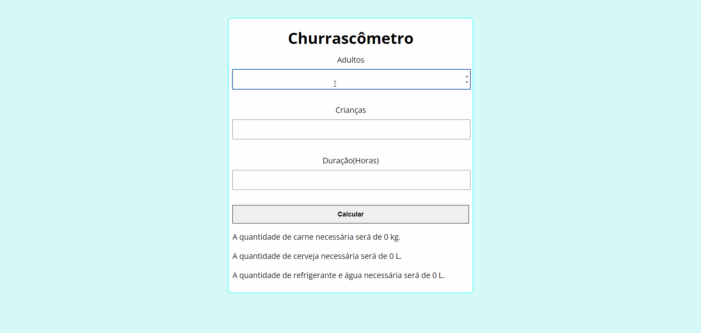

# ✔️ Project
A barbecue calculator that does the account to know how much you will need to make a BBQ based on the rules below, the calculator is made in Javascript

## Interface 
<h1 align="center">
    
</h1>

## Rules
**1. Each person in a BBQ eats average 400g of meat (if the event duration is more than 6 hours, the average will be 650g meat for person);** 
**2. Each person in a BBQ drinks average 1.2L of beer (if the event duration is more than 6 hours, the average will be 2L beer for person);**
**3. Each person in a BBQ drinks average 1L of soda/water (if the event duration is more than 6 hours, the average will be 1.5L soda/water for person);** 
**4. Kids eats and drinks half of all values shown (don't drink beer)**

# 💻 Technologies
## Front End
- **HTML**
- **CSS**
- **JS**
## Back End
- **JS**

# 📝 License
This project have the license of the [MIT](./LICENSE).